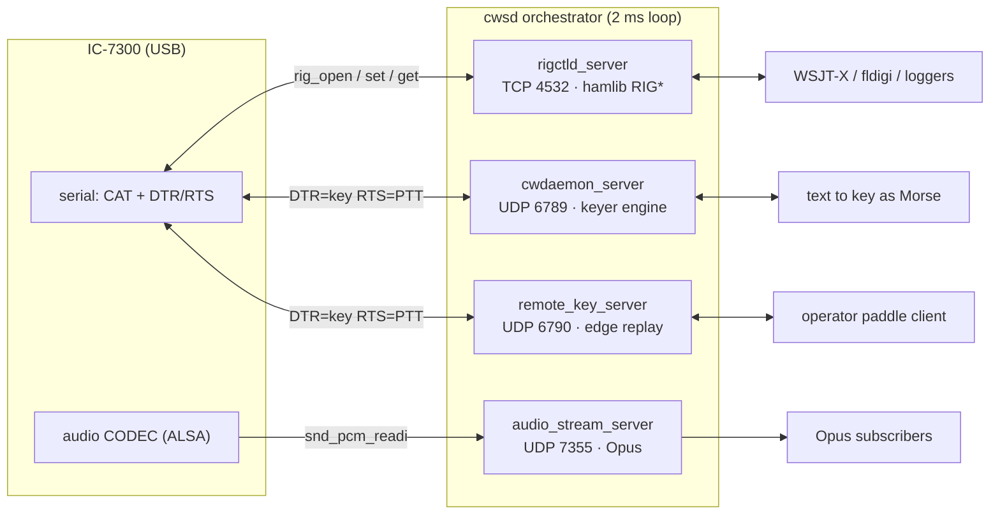

# CLAUDE.md

This file provides guidance to Claude Code (claude.ai/code) when working with code in this repository.

## What this is

`cwsd` is a CW (Morse) sender daemon for ham radio transceivers (developed against the Icom IC-7300). It runs on Linux, links against **hamlib**, and exposes independent network services so logging/contest software can control the rig and send Morse over the wire, plus an optional Opus-over-UDP audio stream and an optional timestamped-edge service for real paddle keying over the internet.

## Build / run

```bash
mkdir build && cd build
cmake .. -DCMAKE_BUILD_TYPE=Release
make -j $(nproc)          # or: cmake --build .  (incremental, from build/)
sudo make install         # installs to /usr/local/bin
```

- Requires CMake ≥ 3.25, a C++20 compiler, hamlib dev headers/libs, and (for the audio stream) ALSA + Opus dev libs (`target_link_libraries(cwsd hamlib Threads::Threads asound opus)`).
- `cmake/GitVersion.cmake` generates `cwsdver-GitVersion.h` from git metadata at configure time; the version embeds the short hash and a `-dirty` flag.
- Run: `./cwsd` (foreground), `./cwsd -d` (daemonize via double-fork), `./cwsd --version`.
- There is **no test suite** and no linter configured.

> **Rebuild cwsd after any hamlib (or OS) upgrade — CAT breaks *silently* otherwise.**
> cwsd links `libhamlib` dynamically, and hamlib changes its ABI within the 4.x series
> while keeping the `libhamlib.so.4` soname. So after an upgrade the **old binary still
> links and runs** — `ldd` resolves, the Opus audio stream works — but `rigctld_server`'s
> use of the misaligned hamlib API fails: it accepts TCP clients yet returns **nothing** to
> every command (`f`, `m`, even the hardcoded `\dump_state`), so WSJT-X just connect/times-out
> every ~10 s. "It still runs" is **not** proof it works; verify CAT explicitly:
> `python3 -c 'import socket,time;s=socket.create_connection((HOST,4532),timeout=4);s.settimeout(3);s.sendall(b"f\n");time.sleep(.4);print(s.recv(60))'`
> should return the dial frequency. The fix is just `cmake .. && make && sudo make install`
> against the current hamlib, then restart cwsd.
>
> **Updating hamlib itself** (no usable Ubuntu PPA exists — the ones on Launchpad are years
> stale): build the latest release from source — `curl -L .../hamlib-X.Y.Z.tar.gz`,
> `./configure --prefix=/usr/local && make && sudo make install && sudo ldconfig`. It
> installs `libhamlib.so.4` to `/usr/local/lib`, which `ldconfig` prefers over the distro
> copy in `/usr/lib`; the apt package stays installed but shadowed (so apt hamlib updates no
> longer reach cwsd — you now manage it manually). **Then rebuild cwsd** (above).

## Configuration

Config path: `cwsd` defaults to `~/.config/cwsdrc`, but `-c`/`--config` overrides it — and the installed systemd unit passes `--config /etc/cwsd/cwsdrc` (a *system* path, since under `DynamicUser=yes` there is no per-user `~/.config`). Despite the `rc` name it is **YAML**, parsed via the bundled fkYAML header (`src/libs/node.hpp`). See `cwsdrc.sample`. The `rig.model` field is a hamlib rig model number (e.g. `3073` = IC-7300). Each service (`cwdaemon`, `rigctld`) has its own `enabled` flag and TCP/UDP port.

## Architecture

The process is a thin orchestrator (`cwsd` class in `src/cwsd.cpp`) that owns up to four servers, each gated by its own config section. `cwsd::run()` is a 2 ms polling loop calling `update()` on each enabled server; a `SIGINT`/`SIGTERM` handler flips the static `is_running` flag to shut down. Each server additionally runs **its own worker thread**, so `update()` on the main thread is light (for `audio_stream_server` and `remote_key_server`, `update()` is a no-op — they are driven entirely by their worker threads).



(`cwdaemon` and `remote_key` share the serial device's DTR/RTS lines — you can enable both, but don't key through both at once.)

### rigctld_server (`src/rigctld_server.*`)
A partial reimplementation of hamlib's **rigctld TCP protocol** (default port 4532) so clients like WSJT-X/fldigi can query and set frequency, mode, PTT, VFO, etc.
- Owns the hamlib `RIG*` handle (`rig_init` + `rig_open` using the configured model and serial device path) and serves multiple clients with a single `poll()`-based non-blocking event loop in `work()`.
- Disconnect detection is a **hack**: a `rig_set_debug_callback` matches the string `"read failed"` to mark the rig disconnected, then the loop drops clients and attempts to reopen. hamlib open/close/cleanup must all happen on the worker thread.
- `interpret_command()` is the protocol command dispatcher (single-letter commands like `f`/`F` freq, `m`/`M` mode+filter-width, `t`/`T` PTT, `l`/`L` level get/set, `q`/`Q` quit, plus `\`-prefixed extended commands like `\get_powerstat`/`\set_powerstat`). Note there is no standalone "filter" command: the filter passband is the width field carried alongside mode in `m`/`M`. Levels go through `rig_parse_level` + `rig_get_level`/`rig_set_level`, so any hamlib level the rig supports works — e.g. `L AGC 0` to disable AGC, `L AGC 5` (RIG_AGC_MEDIUM) to re-enable it (used by xlog2's rig panel AGC button). `dump_state()` is a near 1:1 port of a specific hamlib commit and contains hardcoded values noted with `TODO`s.

### cwdaemon_server (`src/cwdaemon_server.*`)
Implements the **cwdaemon UDP protocol** (default port 6789). `client_worker()` (its own thread) receives datagrams: ESC-prefixed control commands (`ESC 5` = exit, `ESC 4` = abort) and plaintext to key as Morse.
- Messages are translated into **WinKeyer byte commands** by `cw_daemon::to_winkeyer()` (`src/cw_daemon.cpp`), which handles inline speed changes (`+`/`-`), gaps (`~`), and ESC commands (`ESC 2` set speed, `ESC c` tune for N seconds, `ESC u`/`ESC d` speed delta, etc.), then fed byte-by-byte into the keyer via `keyer::winkeyer_data()`.
- `key_interface` (implements `keyer::hw_interface`) drives the rig's serial control lines over the same device path: **DTR = key, RTS = PTT**, toggled via `ioctl(TIOCMBIS/TIOCMBIC)`. It polls `isatty(fd)` to detect USB serial connect/disconnect and reopens.

### audio_stream_server (`src/audio_stream_server.*`)
Optional, third service (config section `audio`, disabled by default). Captures rig audio from an **ALSA** device, encodes it with **Opus** (links `asound` + `opus`), and fans it out as UDP datagrams to every subscribed client. There is **no configured target** — only a `port` to bind; clients subscribe (and NAT-punch) by sending any datagram to that port.
- Like the other servers it spawns a worker thread in its constructor and joins it in `stop()`; `update()` is a no-op, so the streaming cadence is never coupled to the 2 ms main loop. The encoder and bound UDP socket are set up in the constructor (a bind failure throws); ALSA capture is (re)opened on the worker thread so a missing device never blocks startup.
- `work()` reads `frame_ms` worth of S16LE frames via `snd_pcm_readi` (recovering from `-EPIPE` overruns with `snd_pcm_prepare`), Opus-encodes each frame, and `broadcast()`s it to all clients. Device disconnect is handled like `key_interface`: on read failure it closes and retries `open_capture()`.
- **Client tracking** (`poll_clients()`, called once per frame): the bound socket is **non-blocking**; each pending datagram registers or refreshes its sender in the `clients` map (keyed by `addr<<16 | port`), ignoring the payload. Clients silent longer than `client_timeout_ms` are dropped, so subscribers must keep sending a small periodic keepalive. The whole map lives on the worker thread (recv, expire, send), so no locking is needed.
- **Wire format** (server→client): a 4-byte big-endian sequence number followed by the raw Opus packet; the same sequence stream goes to every client. `sample_rate` must be a valid Opus rate (8/12/16/24/48 kHz) and `frame_ms` a valid Opus frame size.

### remote_key_server (`src/remote_key_server.*`, `src/remote_key_protocol.h`)
Optional, fourth service (config section `remote_key`, disabled by default). Enables **real paddle keying over the internet** by replaying timestamped key edges, rather than the buffered text model `cwdaemon_server` uses. The design rationale (why timestamps not events, why the keyer runs operator-side, the QSK trade-off) is in the file header comments.
- **Why timestamps, not events:** the operator's client stamps every key transition against a per-session monotonic clock and streams them; the rig **replays each edge behind a fixed `playout_ms` delay**. As long as a packet arrives before its playout slot, the original element spacing is reproduced exactly — network jitter is absorbed by the buffer instead of smearing the Morse. The keyer/iambic logic and sidetone live on the *operator* side (on jitter-free local input); the rig runs no keyer state machine, just edge replay. A straight key is the degenerate case (raw edges).
- **Wire format** (`remote_key_protocol.h`, operator→rig, big-endian like audio): header `magic(1) version(1) flags(1) session_id(2) edge_count(1)`, then `edge_count` × `{ ts_us(8) state(1) }`. `state` bit 0 = key-down, bit 1 = optional explicit PTT. Each packet carries up to `MAX_EDGES` (32) **recent edges as loss-recovery history**, deduped by source timestamp (idempotent), so one lost datagram is recovered by the next. A zero-edge packet is a **keepalive**; a changed `session_id` or `FLAG_SESSION_RESET` re-anchors the rig. This service deliberately **bypasses `udp_server`** (which null-terminates and strips trailing bytes — fine for text, fatal for binary) and binds its own socket.
- **Two threads** (constructor spawns both, `stop()` joins; `update()` is a no-op): `receive_worker()` decodes packets, anchors the operator timeline to local `CLOCK_MONOTONIC` + `playout_ms`, and pushes scheduled edges into a mutex-guarded jitter buffer. `replay_worker()` runs at `SCHED_FIFO` + `mlockall` (same promotion as the cwdaemon keyer thread), drains due edges with `clock_nanosleep(TIMER_ABSTIME)`, and toggles **DTR = key / RTS = PTT** via the same ioctls as `key_interface`.
- **Safety (three independent layers, all in `replay_worker()`):** a **PTT lead/tail sequencer** derived from key activity (assert `ptt_lead_ms` before a key-down, release `ptt_tail_ms` after the last key-up unless another key-down is imminent); a **stream-silence force-up** (`silence_ms`) that drops to a safe state and re-anchors when packets stop; and a **hard max-key-down watchdog** (`max_key_down_ms`) that force-releases the key regardless of protocol state — the backstop against a lost key-up edge leaving the transmitter keyed. The replay loop caps its sleep at 5 ms so these watchdogs keep ticking between sparse edges.
- **Caveats:** you *can* enable this alongside `cwdaemon` on the **same serial device**, but both drive DTR/RTS, so don't key through both at once — they are alternative keying front-ends that would otherwise fight over the control lines. `device` defaults to `rig.port` if unset. The **operator-side client is not part of this repo yet** — it would link the `keyer` engine behind an `hw_interface` whose `on_key_down`/`on_key_up` emit edges (and generate instant local sidetone for feel). Monitoring audio rides the `audio` Opus stream, which lags by the playout delay — so **semi-break-in**, not full QSK.

### keyer engine (`src/keyer/`)
The Morse heart of the daemon — a WinKeyer-compatible keyer written in an embedded-device style: a `keyer` namespace with a single global `data` struct (`keyer_internal_state`) and a `hw_interface` abstraction so the same engine could run on microcontroller or daemon. It is a **state machine**: states enumerated in `keyer_states.h` (`idle`, `send_element`, `key_down`, `tune`, `inter_element_space`, `inter_word_space`, `play`, `autospace`, `winkeyer`, `half_dot_gap`), each a class in its own `keyer_state_*.cpp`. `keyer::update()` ticks the current state. Supporting pieces: `circular_buffer.h`, profiles (speed/weighting/ratio), `morse.*` char patterns, and `oscillator`/`audio_renderer` for sidetone generation.

### Cross-cutting
- **Logging**: easylogging++ (`src/libs/easylogging++.*`), configured in `main.cpp` with hierarchical levels and size-based log rotation (`pre_rollout_callback` renames `.log.1`..`.log.9`). `INITIALIZE_EASYLOGGINGPP` lives in `main.cpp`.
- `src/events.*` defines an event bus that is currently stubbed (`set_event_bus` is a no-op).
- `shared/` holds deployment artifacts: a udev rule (`80-ic7300.rules`) that creates a stable `/dev/icom7300` symlink, and a systemd unit (`cwsd.service`).

## Conventions worth knowing

- The servers each spawn a thread in their constructor and join it in `stop()`. hamlib calls (rigctld), serial ioctls (cwdaemon and remote_key), and ALSA/Opus calls (audio_stream) are confined to their respective worker threads.
- Several values are deliberately hardcoded with `TODO` markers (notably in `rigctld_server::dump_state()` and `chk_vfo`); match the existing style rather than over-engineering when extending protocol coverage.
