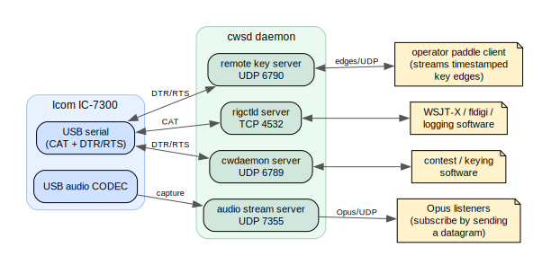

# CWSD

CW sender daemon.

`cwsd` runs on Linux next to your transceiver (developed against the Icom IC-7300),
links against **hamlib**, and exposes several independent network services so logging
and contest software can control the rig, send Morse, stream receiver audio, and even
key the rig with a real paddle over the internet. Each service is individually toggled
in the config and listens on its own port.

## Services

| Service       | Config section | Default port | Protocol            | Enabled by default | Purpose |
|---------------|----------------|--------------|---------------------|--------------------|---------|
| rigctld       | `rigctld`      | TCP 4532     | hamlib rigctld      | yes                | Query/set frequency, mode, PTT, VFO — for WSJT-X, fldigi, etc. |
| cwdaemon      | `cwdaemon`     | UDP 6789     | cwdaemon            | yes                | Receive text and key it as Morse (DTR=key, RTS=PTT). |
| audio stream  | `audio`        | UDP 7355     | Opus over UDP       | no                 | Capture rig audio (ALSA), Opus-encode, fan out to subscribers. |
| remote key    | `remote_key`   | UDP 6790     | timestamped edges   | no                 | Replay real paddle keying over the internet (DTR=key, RTS=PTT). |



<sub>Diagram source: [`docs/architecture.dot`](docs/architecture.dot) — regenerate with `dot -Tsvg docs/architecture.dot -o docs/architecture.svg`.</sub>

> **Note:** `cwdaemon` and `remote_key` both drive the same DTR/RTS control lines, so do
> **not** enable them together on the same serial device — they are alternative keying
> front-ends. The audio stream has no configured target; clients subscribe (and NAT-punch)
> by sending any datagram to its port, then must send a periodic keepalive.

## Instructions:


```
mkdir build
cd build
cmake .. -DCMAKE_BUILD_TYPE=Release
make -j $(nproc)
sudo make install
```

Build requirements: CMake ≥ 3.25, a C++17 compiler, hamlib dev headers/libs, and — for the
audio stream — ALSA and Opus dev libs. On Debian/Ubuntu:

```
sudo apt install libhamlib-dev libasound2-dev libopus-dev
```

## Configuration

By default _cwsd_ will read configuration from `~/.config/cwsdrc`. Despite the `rc` name it
is **YAML**. The `rig.model` field is a hamlib rig model number (e.g. `3073` = IC-7300). Each
service has its own `enabled` flag and port. See `cwsdrc.sample` for the fully-commented
template. A typical configuration:

```yaml
rig:
  port: /dev/icom7300      # stable symlink from the udev rule below
  model: 3073              # hamlib rig model: Icom IC-7300
cwdaemon:
  enabled: true
  port: 6789
  initial_wpm: 40
rigctld:
  enabled: true
  port: 4532
audio:                     # Opus receiver-audio stream (off by default)
  enabled: false
  device: plughw:0,0       # ALSA capture device (numeric index is most robust)
  port: 7355               # UDP port to bind; clients subscribe by sending here
  sample_rate: 48000       # opus rates only: 8000/12000/16000/24000/48000
  channels: 1
  bitrate: 32000           # opus target bitrate in bits/s
  frame_ms: 20             # opus frame size: 2.5/5/10/20/40/60
  client_timeout_ms: 10000 # drop subscribers silent longer than this
remote_key:                # real paddle keying over the internet (off by default)
  enabled: false           # do NOT enable together with cwdaemon on the same device
  port: 6790               # UDP port to bind for the timestamped edge stream
  # device: /dev/icom7300  # serial device with DTR=key/RTS=PTT; defaults to rig.port
  playout_ms: 150          # jitter-buffer depth; the rig lags the operator by this much
  silence_ms: 250          # force key-up if no packet arrives for this long
  max_key_down_ms: 5000    # hard watchdog: never hold the key down longer than this
  ptt_lead_ms: 10          # assert PTT this long before the first key-down
  ptt_tail_ms: 100         # hold PTT this long after the last key-up
logging:
  level: info
  filename: /tmp/cwsd.log
  max_size: 1048576
```

### ALSA capture device (audio stream)

Use a numeric device string such as `plughw:0,0` rather than the by-name form
`plughw:CARD=CODEC,DEV=0` — name resolution can fail when cwsd runs under systemd
(`Cannot get card index for CODEC`). The user running cwsd must be in the **`audio`**
group to open `/dev/snd/*`. List capture devices with `arecord -l`.

## Usage:

`cwsd` will simply run in foreground. Config will be loaded from `~/.config/cwsdrc`

`cwsd -d` will make it daemonize.

`cwsd --version` will print the current running version.

## Making a fixed symlink for the USB device the rig connects to

- `sudo cp shared/80-ic7300.rules /etc/udev/rules.d/`
- `sudo udevadm control --reload-rules && sudo udevadm trigger`

After plugging in the Icom 7300 USB cable a `/dev/icom7300` symlink will be created pointing to the actual `/dev/ttyUSBx` device that the rig was allocated. The rule matches a specific rig serial — edit `ID_SERIAL_SHORT` for your unit (find it with `udevadm info -q property -n /dev/ttyUSB0 | grep ID_SERIAL_SHORT`). The user running cwsd must also be in the **`dialout`** group to open the serial port.

## Installing as a systemd service

- edit `shared/cwsd.service` and set the appropriate user/group
- `sudo cp shared/cwsd.service /etc/systemd/system/`
- `sudo systemctl daemon-reload`
- `sudo systemctl enable --now cwsd.service`

The unit grants `CAP_SYS_NICE`/`CAP_IPC_LOCK` so the keyer thread can run at real-time
priority for jitter-free element timing.

## Authors

* YO6SSW - Adrian Scripcă <benishor@gmail.com>
* YO3GEK - Matei Conovici <mconovici@gmail.com>
